# 物联网设备固件分析指南

本测试指南旨在帮助安全从事行业中者快速了解物联网固件安全，掌握分析物联网设备技能，并具备深入研究和分析物联网设备漏洞的能力。 

**前言**

感谢以下各位师傅的辛勤付出，大家在阅读文章和学习的过程中遇到不妥当分析和描述，亦或者需要帮助的地方可直接通过邮箱联系各位师傅，同样也欢迎各位师傅的加入。

:handshake: Arrebol [中科院软件所 南京软件技术研究院] :e-mail:caojun@nj.iscas.ac.cn

:handshake:

:handshake:


## 环境配置

为了确保能够快速而顺利地进行固件安全测试，通常需要一个良好的分析环境，可以省去多数环境配置和软件安装依赖等问题。推荐以下两款常用于物联网领域的虚拟机attify和IOT-Research，虚拟机资源都是从互联网中收集，可根据自身需要选择是否使用。

### attify OS 虚拟机

[attify](https://github.com/adi0x90/attifyos) (虚拟机账户口令`iot`:`attify`)

下载地址：谷歌云盘 - <https://drive.google.com/drive/folders/1C5BKrpoCtxqZODbF0A-tt0UNjx-UmKt3>


**AttifyOS虚拟机安装步骤：**

1. 下载连接中提供的虚拟机文件，使用VMware workstation打开虚拟机(文件-->打开[Ctrl+O])，选中AttifyOS v3.0.ova文件。


2. 按照提示的步骤导入虚拟机 ，选择合适的路径存储新的虚拟机，等待虚拟机导入完成。


3. 导入成功就可以直接开启虚拟机，同时在虚拟机描述信息中也标明了账户和口令信息。


4. 开启虚拟机进入系统，默认用户iot，不需要登录口令。


### IOT-Research虚拟机

[IOT-Research](https://www.iotsec-zone.com/article/110)虚拟机账户口令：`iot`：`iot`

百度云盘的分享链接如下(提取码：`nqy3`)：
windows版虚拟机

> 链接： <https://pan.baidu.com/s/1ke6gvJ9sFlnpPE17O9nMuQ>

Mac M1版虚拟机

> 链接：<https://pan.baidu.com/s/10BIt97pd4XQUyraAINdicw>

下载好文件虚拟机后，同样的方式打开并登录虚拟机。


其中包含很多已经安装了很多常用的工具，例如binwalk、FirmAE 、flashrom等。


## 1. 获取固件

- 从供应商的support网站获取

对于固件获取，第一种最直接的方法就是通过官网的下载渠道，来获取相应的固件文件。首先找到官网的网址，根据官方提供的固件下载链接进行下载。例如获取DrayTek厂商的设备固件：https://www.draytek.com/support/resources/routers#version


也有部分厂商仅在官网提供最新版本的固件，当我们需要一些旧版本的固件时，不知道路径的话很难下载到。有部分厂商的多数固件都是放在某个FTP服务器目录下，知道地址即可获取到固件。例如DrayTek固件服务器：https://fw.draytek.com.tw/


当然，部分厂商的固件在国内的官网中是难以下载到的，或着国内厂商提供的固件并不是大家需要的，此时可以访问该厂商针对不同国家提供的官网页面进行下载。例如海康威视在国外和国内的官网提供的固件下载的数量和固件的排序方式存在较大差矣。在获取固件时多去不同地区的官网进行查找，往往有意想不到的收获。

HIKVISION EUROPE B.V 提供的固件


HIKVISION CHINA B.V 提供的固件


国内外常见路由器厂商的固件下载链接：

| 厂商           | 下载链接                                                     |
| -------------- | ------------------------------------------------------------ |
| D-LINK         | https://tsd.dlink.com.tw/ddwn                                |
|                | https://files.dlink.com.au/products/                         |
|                | http://www.dlink.com.cn/techsupport/                         |
| TOTOLINK       | https://www.totolink.net/home/index/menu_listtpl/listtpl/support/id/27.html |
| FAST           | https://service.fastcom.com.cn/download-list.html#0          |
| TP-LINK        | https://resource.tp-link.com.cn/?&productorlist=1&filterClass=[4] |
| MERCURY        | https://service.mercurycom.com.cn/download-list.html         |
| TENDA          | https://www.tenda.com.cn/download/cata-11.html               |
| NETCORE(磊科)  | https://www.netcoretec.com/service-support/download          |
| NETIS          | https://www.netis-systems.com/Suppory/down.html              |
| UTT(艾泰)      | https://www.utt.com.cn/downloadcenter.php                    |
| RUIJIE(锐捷)   | https://www.ruijie.com.cn/fw/rj/                             |
|                | https://www.ruijienetworks.com/resources/products/1896-1897  |
| WAYOS(维盟)    | https://www.wayos.com/fuwuzhici/xiazaizhongxin/              |
| ADSLR(飞鱼星)  | https://www.adslr.com/companyfile/2/                         |
|                | https://www.feiyuxing.com.cn/Downloads/                      |
| B-LINK         | https://www.b-link.net.cn/downloads_16.html                  |
| ASUS(华硕)     | https://www.asus.com.cn/support/Download-Center/             |
| DrayTek        | https://www.draytek.com/support/resources/routers#version    |
|                | https://fw.draytek.com.tw/                                   |
| NETGEAR        | http://support.netgear.cn/download.asp                       |
|                | https://www.cisco.com/c/zh_cn/support/all-products.html      |
| LB-LINK        | https://www.lb-link.com/support/downloads/                   |
| MIKROTIK       | https://mikrotik.com/download                                |
|                | http://46.167.242.10/firmware/mikrotik/                      |
| IKUAI(爱快)    | https://www.ikuai8.com/component/download                    |
| FORTINET(飞塔) | https://support.fortinet.com/Download/FirmwareImages.aspx    |
|                | https://it-help.tips/en/fortigate-firmware-download/         |
| MI(小米)       | http://www.miwifi.com/miwifi_download.html                   |
| H3C            | https://www.h3c.com/cn/Service/Document_Software/Software_Download/ |
| LINKSYS        | https://www.linksys.com/jp/linksys-support/                  |
| COMFAST        | http://www.comfast.com.cn/index.php?m=content&c=index&a=lists&catid=31 |
| 360            | https://luyou.360.cn/home/support/download?from=nav          |
| WAVLINK        | https://www.wavlink.com/zh_cn/firmware.html                  |
| IP-COM         | https://www.ip-com.com.cn/download/list-5.html               |


- 设备更新进行中间人（`MITM`）获取


 


- 通过 `UART`、`JTAG`、`PICit`等直接从硬件中提取

---

- 从主板卸下闪存芯片（如：SPI ）或 MCU，以进行离线分析和数据提取

  >  **不拆芯片读取固件**

使用夹子、钩子等连接导线，适合引脚较少的芯片。通过夹具夹住芯片引脚，然后连接编程器读取芯片内容，通过编程器连接芯片需要注意引脚的顺序，在 IC 芯片上都会有一个小点，大多数情况下，小点对应的引脚即为芯片的第一脚，而连接编程器的导线也需要插入编程器上相应的引脚。

这里以Winbond 25Q32JVSIQ芯片为例，可以看见图中芯片的右下角有一个小圆点，使用夹子的时候需要将引脚位置相互对应，通常夹子上的导线会有颜色标识，图中的红色导线就是第一脚连接的地方。同时需要正确的使用夹子夹住芯片，保证每个夹脚都正常的和芯片接触。

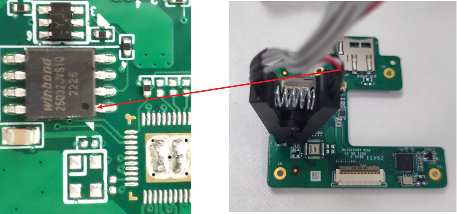

然后可以将夹子的另一端和对应的编程器连接，这里使用的是爱修的RT809F系列编程器，在网上能够轻松的购买到。然后在iFix爱修网下载并安装对应的编程器软件，详细安装过程请参考http://doc.ifix.net.cn/@rt809/CHN.html。


然后将编程器和电脑正确连接，然后打开编程器软件，对与常见的芯片只需要点击编程器软件中的智能识别，然后根据芯片上的信息进行校对。正确地在编程器软件中设置好芯片信息后，点击读取按钮固件就能够正常的从芯片中存储到本地中。

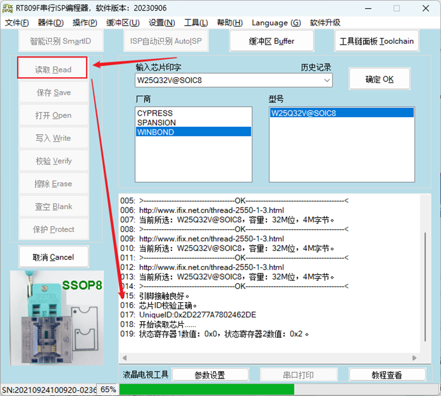

>  拆解芯片读取固件

拆解芯片所使用的硬件工具：热风焊台，恒温内热烙铁（尖头，刀头），吸锡带，吸锡器，助焊剂，松香，镊子，锡丝，隔热胶带等，在拆解芯片时记得提前在芯片引脚涂上助焊剂。

将热风枪的温度设置在350摄氏度左右，距离芯片1-2厘米，持续加热直到芯片引脚锡点融化，使用镊子轻轻触碰，能够感觉到明显的松动，就可以取下芯片。

将烙铁加热到400摄氏度左右，融化一截锡丝至芯片的引脚处，记得提前涂上助焊剂，然后将融化的锡球来回在芯片引脚拖动，来回拖动几次就能够轻松使用镊子取下芯片。

以下是以winbond  W29N0DN60012芯片为例，该芯片拥有48引脚，相比于常见的flash芯片(8pin或16pin)在拆解难度上更大。

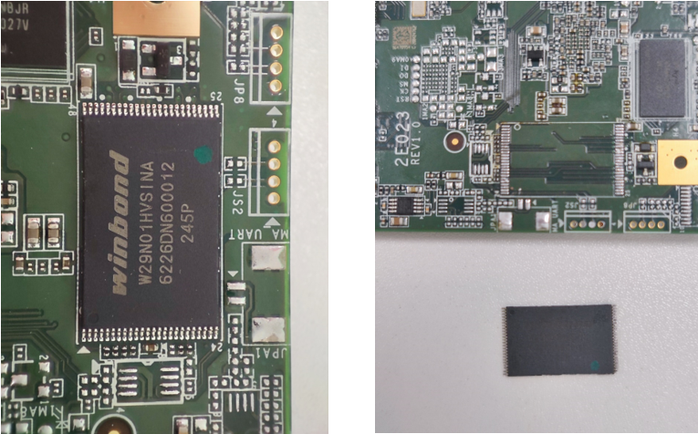

将拆好的芯片表面的焊油擦拭干净，仔细观察芯片的引脚有没有被锡点粘连在一起的现象，使用锡球拖动时温度控制不好，这种芯片的引脚很容易发生粘连，如果发现粘连，在引脚涂上助焊剂使用烙铁仔细清理即可。

将拆解好的芯片放入48脚的底座中，然后使用RT809H编程卡住底座。使用的编程器依然是Ifix爱修的RT809H，当然也有其他可选的编程器，例如T48。


然后将编程器和电脑正确连接，然后打开编程器软件。编程器软件下载链接[国内版 - iFix爱修网](http://doc.ifix.net.cn/@rt809/CHN.html)，点击编程器软件中的智能识别，然后根据芯片上的信息进行校对，点击读取即可。

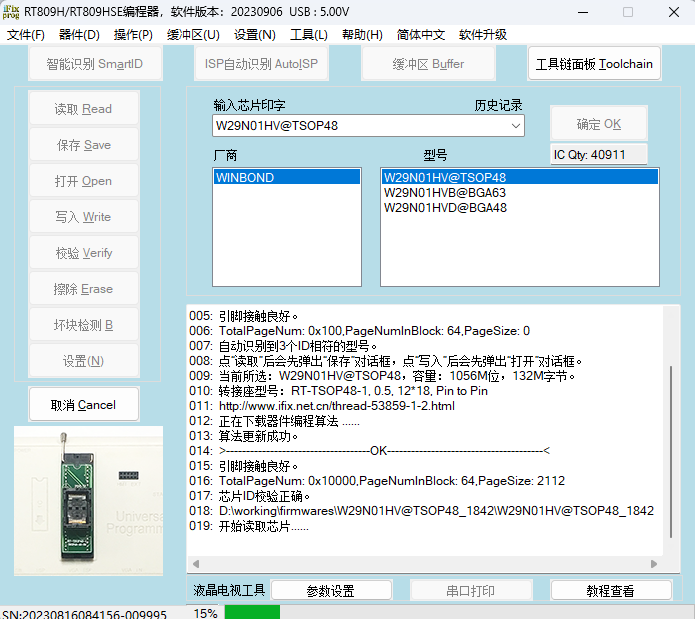


## 2. 分析固件

### 2.1 提取文件系统

binwalk

杂项工具，用于扫描隐藏文件，分离文件

安装：

```python
git clone https://github.com/ReFirmLabs/binwalk.git
cd binwalk
sudo python3 setup.py install
```

使用：

```python
binwalk filename

❯ binwalk 1.mp4
DECIMAL       HEXADECIMAL     DESCRIPTION
--------------------------------------------------------------------------------
27657186      0x1A603E2       PGP RSA encrypted session key - keyid: 7DEBB57A 854F782F RSA (Encrypt or Sign) 1024b
27820636      0x1A8825C       MySQL ISAM index file Version 8
28976826      0x1BA26BA       HPACK archive data
40994603      0x271872B       PNG image, 941 x 320, 8-bit/color RGBA, non-interlaced
40994644      0x2718754       Zlib compressed data, default compression
# 两列数字是偏移，可以 dd 手动分离
dd if=1.mp4 of=1.jpg skip=40994603 bs=1
# 这里if是指定输入文件，of是指定输出文件，skip是指定从输入文件开头跳过140147个块后再开始复制，bs设置每次读写块的大小为1字节 
```

可以使用 binwalk 的 `-e` 参数来提取固件中的文件

```python
binwalk -e test.bin
```

如果你还指定了 `-M` 选项，binwalk 会递归扫描文件

```python
binwalk -Me test.bin
```

如果指定了 `-r` 选项，则将自动删除无法提取的任何文件签名或导致大小为 0 的文件

```python
binwalk -Mre firmware.bin
```

还可以使用 binwalk 进行固件比较，指定 `-W` 选项
或者 -hexdump 指令

```python
binwalk -W test1 test2 test3
```


firmware-mod-kit

基于binwalk的解打包工具，但是由于很久没用更新，使用场景有限。

安装方法：

首先安装依赖

```python
sudo apt-get install git build-essential zlib1g-dev liblzma-dev python-magic
```

安装工具

```python
git clone https://github.com/mirror/firmware-mod-kit.git  
  
cd firmware-mod-kit/src  
  
./configure && make
```

解包固件
将固件 firmware.bin 解包到 working_directory/ 下

```python
./extract_firmware.sh firmware.bin working_directory/
```

重新打包固件
将新生成的固件放到 output_directory 下

```python
./build_firmware.sh output_directory/ working_directory/
```


基于binwalk的解打包工具，但是由于很久没用更新，使用场景有限。


### 2.2 分析文件系统

#### 2.2.1 手动分析

静态分析文件系统


#### 2.2.2 工具分析

借助一些自动化的工具对固件的文件系统进行分析

[firmwalker](https://github.com/craigz28/firmwalker)

[fwanalyzer](https://github.com/cruise-automation/fwanalyzer)


#### 2.2.3 动态分析

设备在正常运行或者在仿真环境中运行中的动态测试

借助调试工具GDB、FirmAE


## 3. 固件仿真


### 3.1 局部仿真

qemu-user

### 3.2 系统仿真

qemu-system

#### 自动化仿真工具

[firmware-analysis-toolkit](https://github.com/attify/firmware-analysis-toolkit)

[FirmAE](https://github.com/pr0v3rbs/FirmAE)

[firmdyne](https://github.com/firmadyne/firmadyne)

[EMUX](https://github.com/therealsaumil/emux)


## 4. 固件自动化分析工具

[FACT_core](https://github.com/fkie-cad/FACT_core)


[EMBA](https://github.com/e-m-b-a/emba)


[Podding](https://podding.cn/#/login)


## 5. 漏洞分析与利用


## 6. 漏洞挖掘思路与技巧


## 7. 固件解密


### 7.2 解密的方法

针对物联网终端设备的固件解密，总结如下五种方法和技巧：

1. **基于老版本未加密固件中的解密程序实现新版本加密固件的解密**

对于固件出厂时未加密，后续发布的固件是加密的情况，可以通过对比边界版本，解包最后一个未加密版本逆向升级程序还原加密过程，以实现对加密固件的解密。

2. **基于调试串口直接提取未加密固件**

如果设备存在UART、JTAG等调试接口，可通过连接硬件接口获取设备的Shell，从而dump出设备的固件。

但由于某些设备安全限制较高导致无法进入Linux Shell，我们可尝试进入BootLoader Shell（最常见的是Uboot Shell）对固件进行提取。这里要说明的一点是部分设备更新固件后会将解密后的新版固件写回Flash，这种情况下dump出的固件是未加密的，而相反的是部分设备Flash中的固件一直是加密状态存在，只是在每次设备启动时进行动态解密。所以此种方法提取出的固件可能也是加密的，但好处在于可以避免因拆解设备Flash去读固件导致设备损坏的风险，并且可以获取到较为完整的固件（官方下载的固件可能只是某块数据的更新包）。

3. **基于管理服务获取设备Shell提取文件系统**

对于有Telnet、SSH等服务的设备，可以通过这些服务进入设备的Linux Shell进行固件提取。服务一般在设备的web管理页面中可手动开启，但需要说明的一点是某些厂商会开发自家的CLI屏蔽掉底层Linux Shell，连接这些服务进入的Shell只是厂商的CLI，也无法提取文件系统，不过某些设备（光猫居多）的CLI存在可进入Linux Shell的命令，具体可自行在互联网上搜索相应的方法。

4. **基于低版本固件RCE漏洞获取设备Shell分析解密逻辑实现对新版固件的解密**

如果设备历史加密版本固件出现过RCE漏洞，可将存在漏洞的固件刷入设备，通过RCE漏洞获取设备Linux Shell，再分析其包含的解密逻辑，最终通过该解密逻辑实现对更新版本固件的解密。需要注意的是存在RCE漏洞版本的固件所使用的加密方案需要与新版本固件一致。

5. **直接分析完整固件中包含的解密逻辑实现对固件的解密**

常见情况下固件的解密逻辑肯定是存在Flash中的，当获取到完整版固件（拆机从Flash读取或者从BootLoader Shell中提取等）后，可以直接对整个固件进行逆向分析寻找解密逻辑代码实现对固件的解密，但此种方法难度较大，并且这类设备安全性一般较高，很有可能分析出了解密逻辑但拿不到解密密钥，如密钥单独存放在某个安全芯片中。

### 7.3 固件解密步骤

1. 通过设备固件中间过渡版本或者通过物理设备的UART接口进入到系统中获取解密程序和算法（可以观察固件名称，带有Middle_FW_Unencrypt这种字符的基本都是中间版本，包含解密程序）
2. 利用QEMU执行跨架构的chroot，获取有效SHELL。
3. 使用获得的解密程序对加密固件进行解密
4. 测试解密程序是否对新版本加密固件有效，若对新版本固件无效解密，很可能还包含其他中间过渡版本。

### 7.4 固件解密演示

#### 解密DIR-878

以D-LINK设备 DIR-878 为例，通过中间版本能直接拿到固件的解密程序或者算法，通过解密程序再去解密新的固件。DIR-878 的固件中间过渡版本没有加密但是包含解密程序，可以通过 binwalk 直接获取固件的文件系统。

DIR-878固件下载地址：https://tsd.dlink.com.tw/ddetail

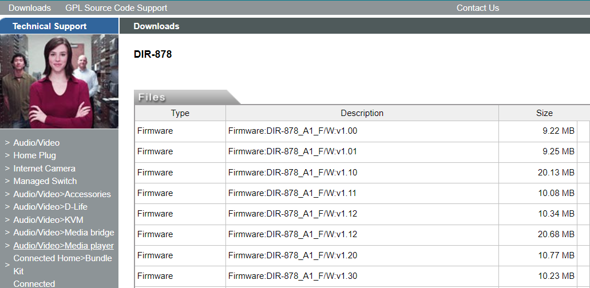

将固件都下载到本地中，使用binwalk检查最早的固件版本，它将正确检测到uImage标头和LZMA压缩数据，能检测到就直接使用 -Me参数进行递归提取。

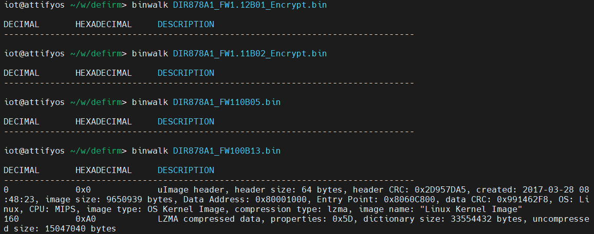

最终在 1.10B05 固件压缩包中获取到中间版本的固件：DIR878A1_FW104B05_Middle_FW_Unencrypt.bin（所谓中间版本就是该版本使用binwalk可以检测到数据，后面版本都不能检测到数据，就可以猜测该版本为中间版本） 提取中间版本(DIR878A1_FW104B05_Middle_FW_Unencrypt.bin)的文件系统

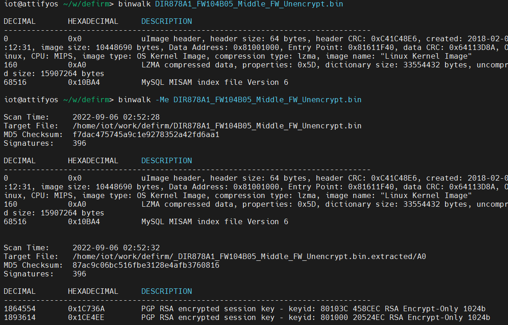

找到了中间版本，按照固件升级的思路，肯定有一个升级程序，在这个程序内部可能存在着加密算法，我们首要目的就是去寻找这个解密程序。最终在程序目录 /bin文件夹下面，发现了一个名为 imgdecrypt 的二进制文件。

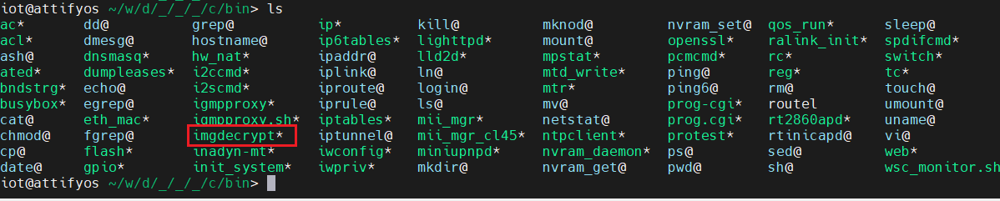

因为主机(x86)和二进制文件(MIPS)之间的处理器体系结构上存在差异。

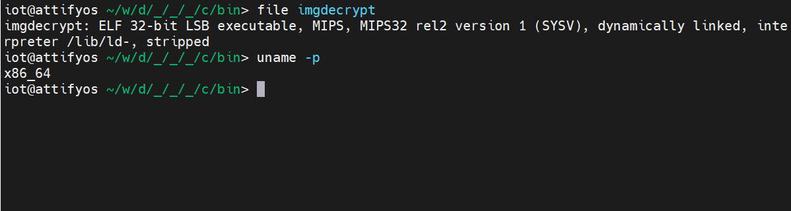

可以使用QEMU执行跨架构的chroot。为此，首先我们将qemu-mipsel-static二进制文件复制到固件根文件系统的/usr/bin/目录中，我们还将加密的固件复制到未加密的固件文件系统。最后，我们将chroot插入固件根目录并获得一个有效的shell，然后运行执行解密的二进制程序，按照提示输入需要解密的固件，输出key代表固件已经成功的被解密。(未将QEMU放在正确位置，启动任何程序都会报错No such file or directory。这个报错会有很多歧义，因此一定要自己确认一下QEMU确实在rootfs的“/usr/bin”目录中)

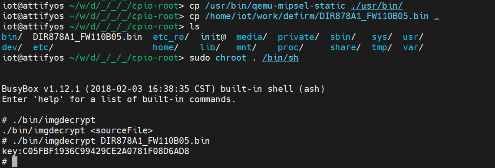

使用binwalk再次对解密后的固件(1.10B05)进行检测，已经成功的获取到了固件的uImage标头和LZMA压缩数据。（执行binwalk前注意要给固件读写权限）这样就成功的解密了固件，并提取到了固件文件系统

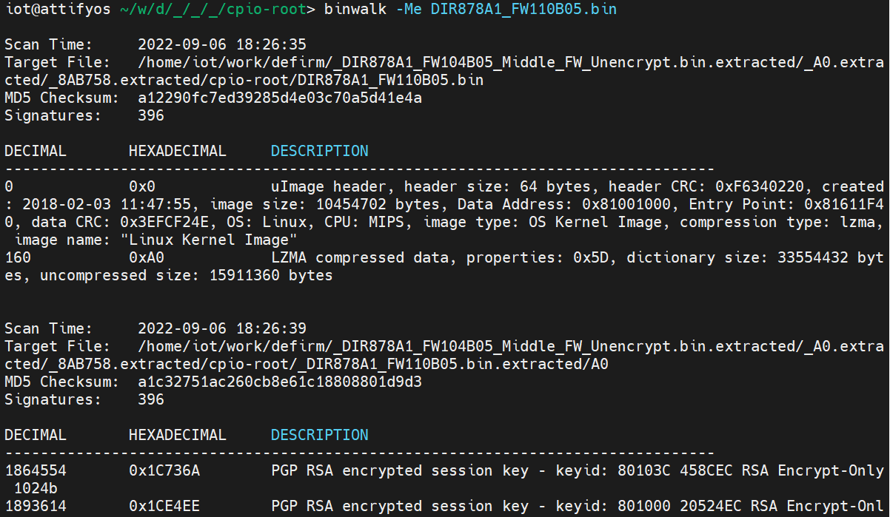

当然这种方式还是比较麻烦，在GitHub中已经有大佬完善了整个解密过程，通过逆向分析解密程序imgdecrypt，还原解密算法并找到硬编码的密钥信息。该解密脚本目前能够支持的固件版本：包括但不仅限于DIR-825、DIR-867、DIR-878、DIR-882、DIR-1260、DIR-1960、DIR-2660、DIR-3060。

解密脚本链接：https://github.com/0xricksanchez/dlink-decrypt

逆向分析文章：

- 第一篇：https://0x00sec.org/t/breaking-the-d-link-dir3060-firmware-encryption-recon-part-1/21943
- 第二篇：https://0x00sec.org/t/breaking-the-d-link-dir3060-firmware-encryption-static-analysis-of-the-decryption-routine-part-2-1/22099
- 第三篇：https://0x00sec.org/t/breaking-the-d-link-dir3060-firmware-encryption-static-analysis-of-the-decryption-routine-part-2-1/22099


#### 解密Linksys-EA6100

需要解密固件的版本是：FW_EA6100_1.1.6.181939_prod.gpg.img (Build 181939)，固件下载地址：https://www.linksys.com/hk/en/linksys-support/（搜索对应的型号）

首先使用binwalk对下载好的固件1.1.6进行检测，并且尝试提取固件，但是并未得到任何有价值的信息。

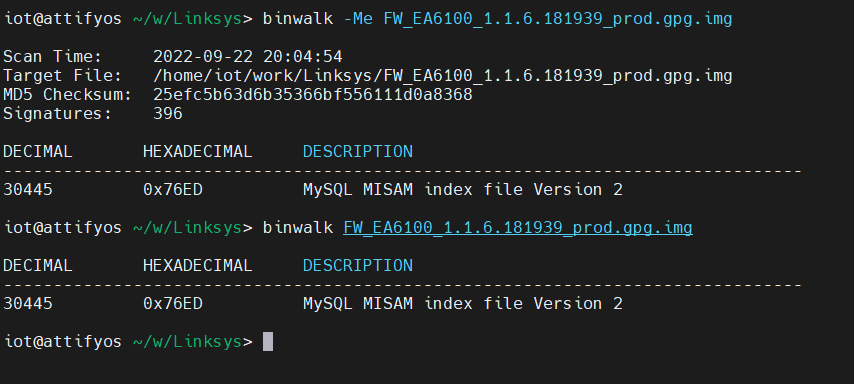

使用binwalk -E 查看固件的熵值，EA6100固件的信息熵接近1，可以说明固件是经过加密的。

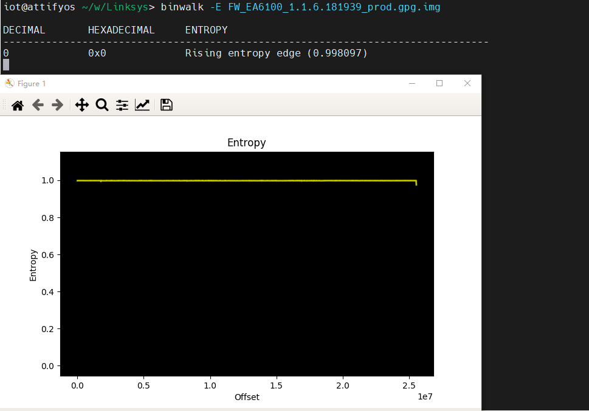

在下载固件的时候，可以看到一个提示信息，需要先下载中间过渡版本。

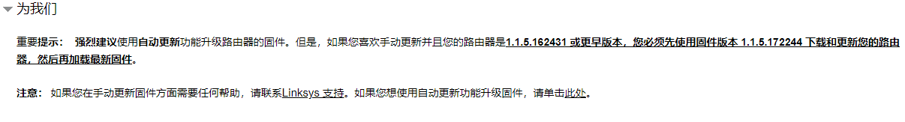

根据提示下载好过渡版本的固件 FW_EA6100_1.1.5.172244_prod.img （Build 172244），并尝试提取固件。

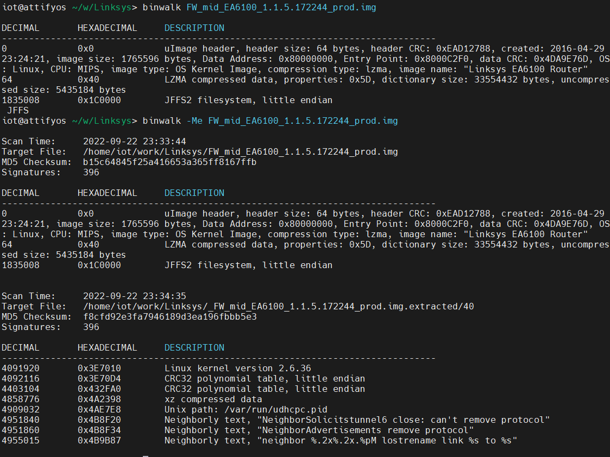

可以看见成功的提取到了文件系统，由于固件更新的目标是加密的，所以猜测固件中存在解密的程序，尝试在解密的文件中寻找相关的解密程序。

在下载固件时，可以发现1.1.6版本的加密固件的命名多了gpg后缀(*.prod.gpg.img)，GPG是不对称加密、数字签名的经典和标准，不但可以为个人的数字传输提供信用保障，用于保护个人之间通讯的隐私，保护敏感数据，而且可以在更大的范围内，如公司范围内的数据加密，电子产品的数字签名，知识产权保护等。可以知道新版本的固件很可能使用了gpg的方式来加密固件。

寻找解密文件，检索一些其他的密钥保存的格式之后，一般都是下面的这种方式

``````
——-BEGIN RSA PRIVATE KEY——- # 私钥内容
… (private key in base64 encoding) …
——-END RSA PRIVATE KEY——-
——-BEGIN CERTIFICATE——- # 证书信息
… (certificate in base64 PEM encoding) …
——-END CERTIFICATE——-
``````

使用grep命令检索文件，找到了类似 gpg 密钥的文件keydata 

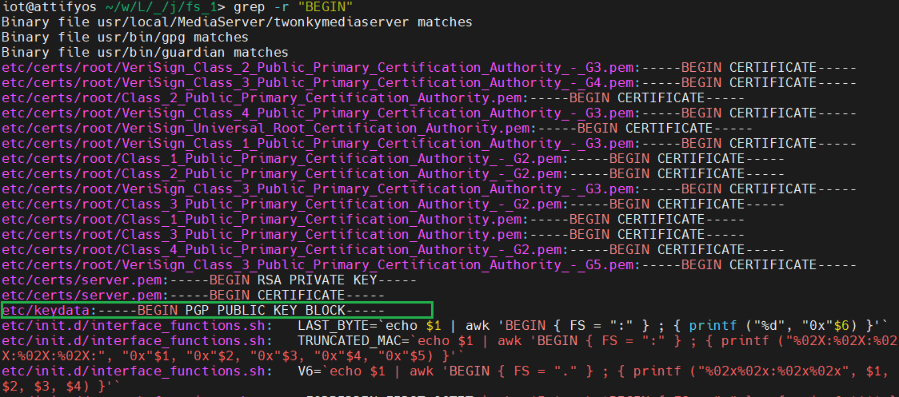

首先将keydata 加载到 主机系统中的 gpg 中，然后再进行对固件包解密

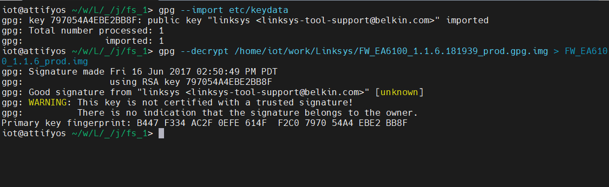

看起来没有出现什么问题，将解密之后的文件进行binwalk探测并尝试提取文件。最终成功的解密固件。

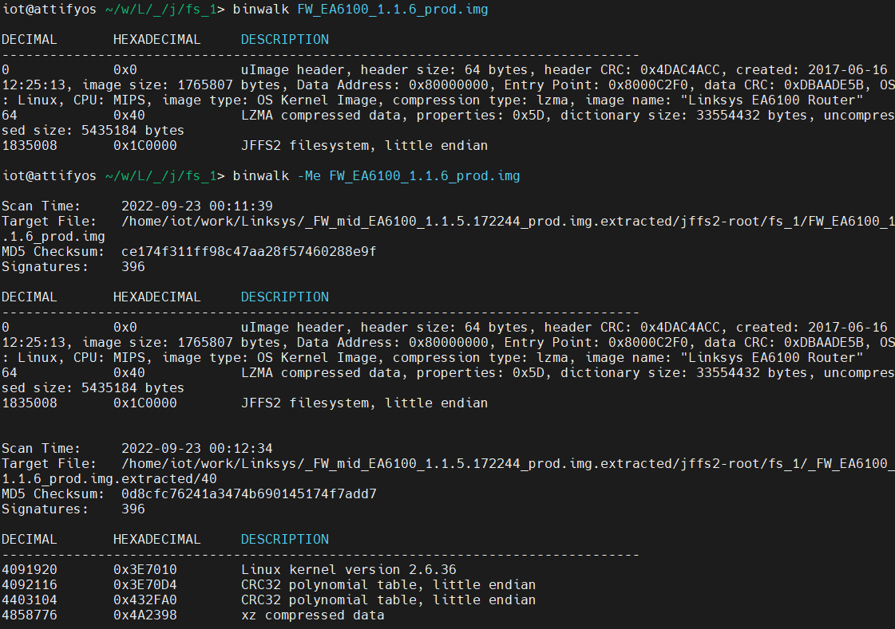


## 8. 安全社区

社区

IOT-ZONE：https://www.iotsec-zone.com/

看雪学苑：https://bbs.kanxue.com/


#### 实验室/个人博客

领先的物联网和移动安全提供商：https://blog.attify.com/

来自新加坡的明星实验室：https://boschko.ca/

星舆车联网安全实验室：http://starvlab.qianxin.com/

 https://www.tarlogic.com/blog/

加拿大皇家银行的高级安全专家：https://starlabs.sg/blog/

物联网安全研究员（ 长亭科技）：https://bestwing.me/

物联网安全研究员（奇安信）https://cq674350529.github.io/

汽车安全研究员（奇安信）：https://delikely.eu.org/

物联网安全研究员：https://www.zhiwanyuzhou.com/

https://resolverblog.blogspot.com/


#### 公众号/订阅号


https://media.defcon.org/


## 9. 安全论文

比较前沿的物联网安全的研究性文章


