# 物联网设备固件分析指南

本测试指南旨在帮助安全从事行业中者快速了解物联网固件安全，掌握分析物联网设备技能，并具备深入研究和分析物联网设备漏洞的能力。 

## 环境配置

为了确保能够快速而顺利地进行固件安全测试，通常需要一个良好的分析环境，可以省去多数环境配置和软件安装依赖等问题。推荐以下两款常用于物联网领域的虚拟机attify和IOT-Research，虚拟机资源都是从互联网中收集，可根据自身需要选择是否使用。

### attify OS 虚拟机

[attify](https://github.com/adi0x90/attifyos) (虚拟机账户口令`iot`:`attify`)

下载地址：谷歌云盘 - <https://drive.google.com/drive/folders/1C5BKrpoCtxqZODbF0A-tt0UNjx-UmKt3>

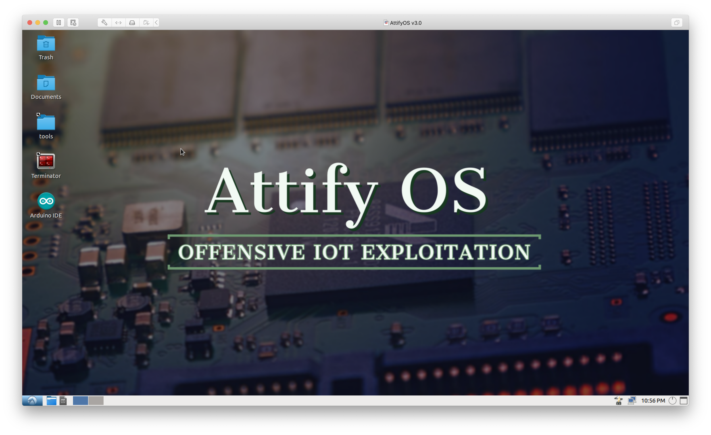

**AttifyOS虚拟机安装步骤：**

1. 下载连接中提供的虚拟机文件，使用VMware workstation打开虚拟机(文件-->打开[Ctrl+O])，选中AttifyOS v3.0.ova文件。

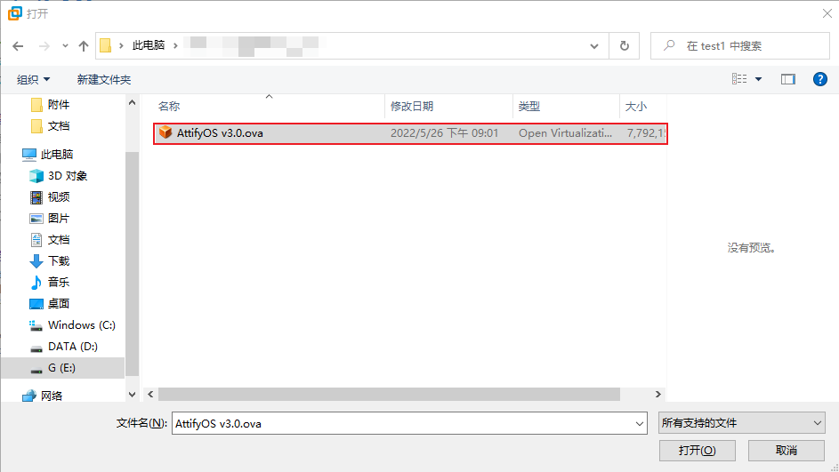

2. 按照提示的步骤导入虚拟机 ，选择合适的路径存储新的虚拟机，等待虚拟机导入完成。

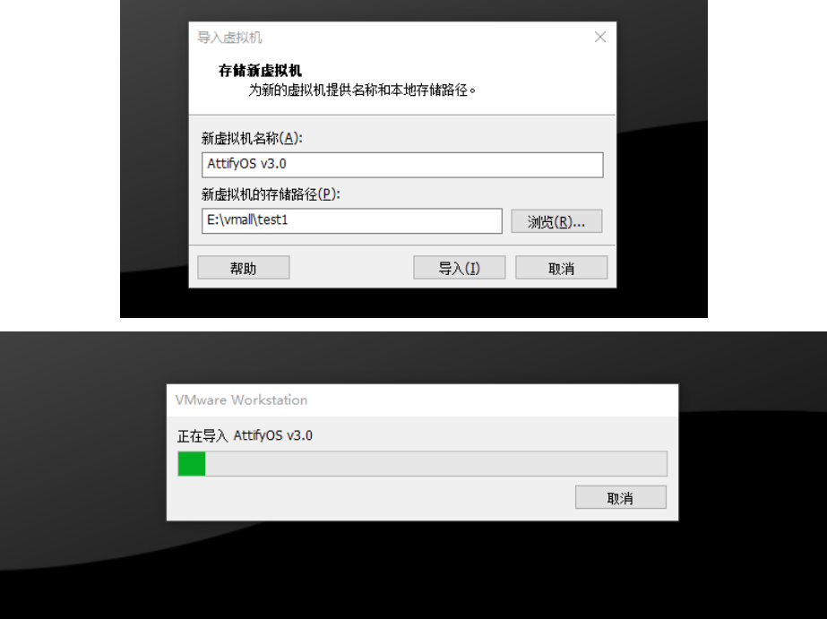

3. 导入成功就可以直接开启虚拟机，同时在虚拟机描述信息中也标明了账户和口令信息。

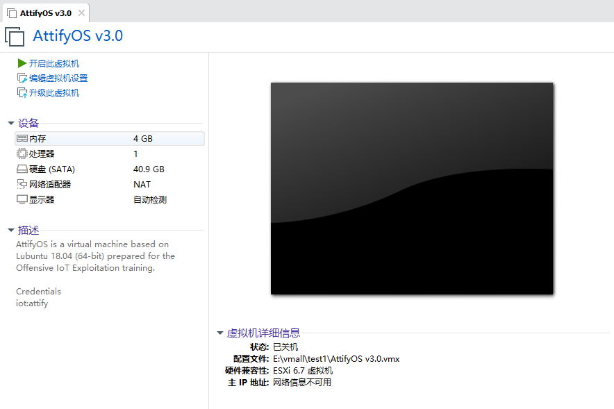

4. 开启虚拟机进入系统，默认用户iot，不需要登录口令。

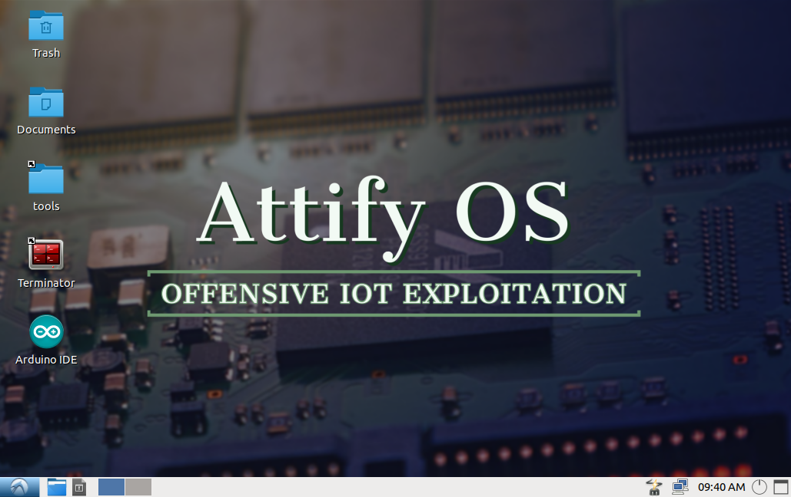

### IOT-Research虚拟机

[IOT-Research](https://www.iotsec-zone.com/article/110)虚拟机账户口令：`iot`：`iot`

百度云盘的分享链接如下(提取码：`nqy3`)：
windows版虚拟机

> 链接： <https://pan.baidu.com/s/1ke6gvJ9sFlnpPE17O9nMuQ>

Mac M1版虚拟机

> 链接：<https://pan.baidu.com/s/10BIt97pd4XQUyraAINdicw>

下载好文件虚拟机后，同样的方式打开并登录虚拟机。

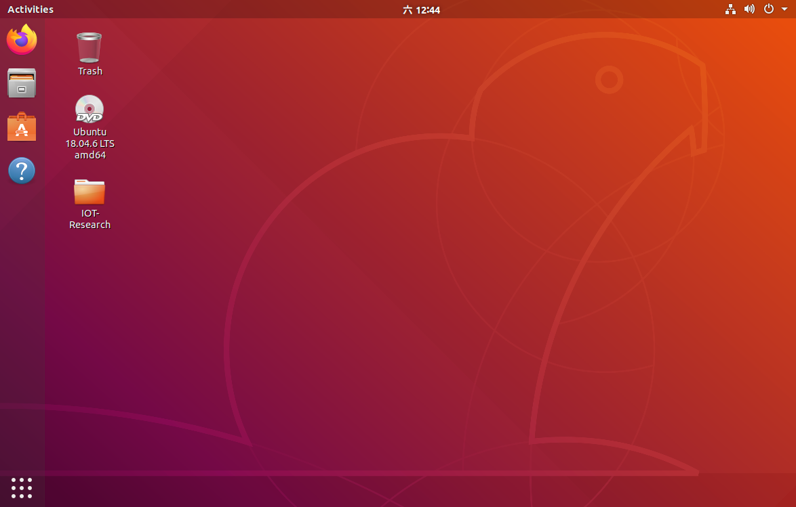

其中包含很多已经安装了很多常用的工具，例如binwalk、FirmAE 、flashrom等。

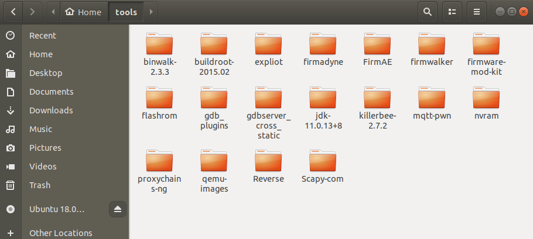

## 1. 获取固件

- 从供应商的support网站获取

对于固件获取，第一种最直接的方法就是通过官网的下载渠道，来获取相应的固件文件。首先找到官网的网址，根据官方提供的固件下载链接进行下载。例如获取DrayTek厂商的设备固件：https://www.draytek.com/support/resources/routers#version

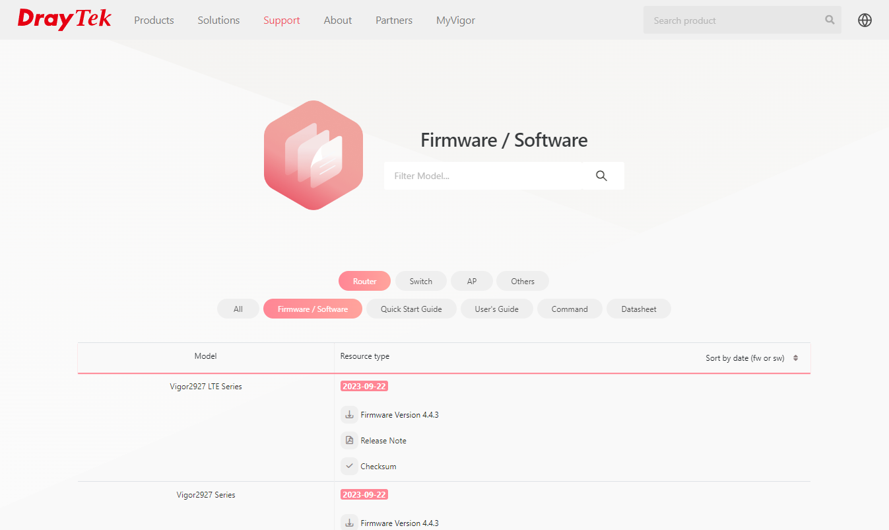

也有部分厂商仅在官网提供最新版本的固件，当我们需要一些旧版本的固件时，不知道路径的话很难下载到。有部分厂商的多数固件都是放在某个FTP服务器目录下，知道地址即可获取到固件。例如DrayTek固件服务器：https://fw.draytek.com.tw/

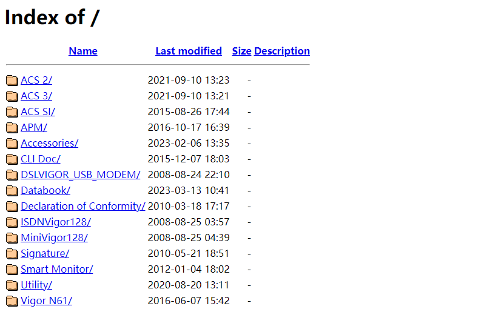

当然，部分厂商的固件在国内的官网中是难以下载到的，或着国内厂商提供的固件并不是大家需要的，此时可以访问该厂商针对不同国家提供的官网页面进行下载。例如海康威视在国外和国内的官网提供的固件下载的数量和固件的排序方式存在较大差矣。在获取固件时多去不同地区的官网进行查找，往往有意想不到的收获。

HIKVISION EUROPE B.V 提供的固件

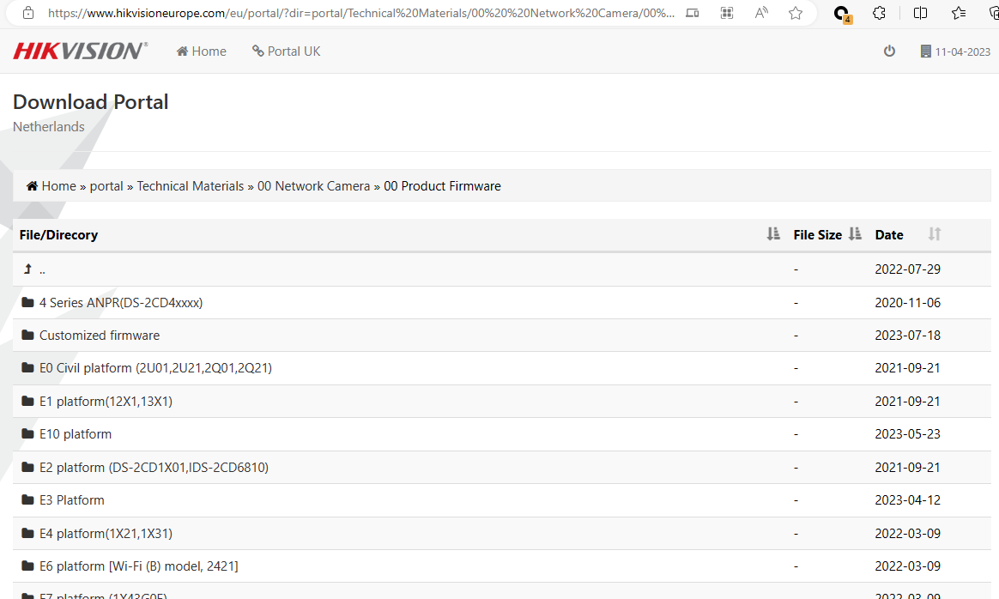

HIKVISION CHINA B.V 提供的固件

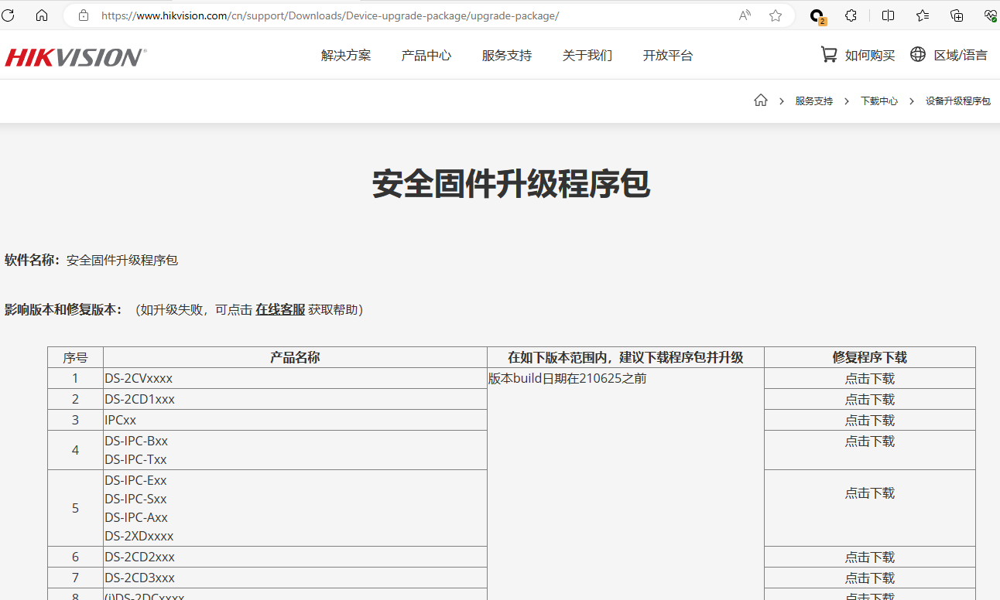

国内外常见路由器厂商的固件下载链接：

| 厂商           | 下载链接                                                     |
| -------------- | ------------------------------------------------------------ |
| D-LINK         | https://tsd.dlink.com.tw/ddwn                                |
|                | https://files.dlink.com.au/products/                         |
|                | http://www.dlink.com.cn/techsupport/                         |
| TOTOLINK       | https://www.totolink.net/home/index/menu_listtpl/listtpl/support/id/27.html |
| FAST           | https://service.fastcom.com.cn/download-list.html#0          |
| TP-LINK        | https://resource.tp-link.com.cn/?&productorlist=1&filterClass=[4] |
| MERCURY        | https://service.mercurycom.com.cn/download-list.html         |
| TENDA          | https://www.tenda.com.cn/download/cata-11.html               |
| NETCORE(磊科)  | https://www.netcoretec.com/service-support/download          |
| NETIS          | https://www.netis-systems.com/Suppory/down.html              |
| UTT(艾泰)      | https://www.utt.com.cn/downloadcenter.php                    |
| RUIJIE(锐捷)   | https://www.ruijie.com.cn/fw/rj/                             |
|                | https://www.ruijienetworks.com/resources/products/1896-1897  |
| WAYOS(维盟)    | https://www.wayos.com/fuwuzhici/xiazaizhongxin/              |
| ADSLR(飞鱼星)  | https://www.adslr.com/companyfile/2/                         |
|                | https://www.feiyuxing.com.cn/Downloads/                      |
| B-LINK         | https://www.b-link.net.cn/downloads_16.html                  |
| ASUS(华硕)     | https://www.asus.com.cn/support/Download-Center/             |
| DrayTek        | https://www.draytek.com/support/resources/routers#version    |
|                | https://fw.draytek.com.tw/                                   |
| NETGEAR        | http://support.netgear.cn/download.asp                       |
|                | https://www.cisco.com/c/zh_cn/support/all-products.html      |
| LB-LINK        | https://www.lb-link.com/support/downloads/                   |
| MIKROTIK       | https://mikrotik.com/download                                |
|                | http://46.167.242.10/firmware/mikrotik/                      |
| IKUAI(爱快)    | https://www.ikuai8.com/component/download                    |
| FORTINET(飞塔) | https://support.fortinet.com/Download/FirmwareImages.aspx    |
|                | https://it-help.tips/en/fortigate-firmware-download/         |
| MI(小米)       | http://www.miwifi.com/miwifi_download.html                   |
| H3C            | https://www.h3c.com/cn/Service/Document_Software/Software_Download/ |
| LINKSYS        | https://www.linksys.com/jp/linksys-support/                  |
| COMFAST        | http://www.comfast.com.cn/index.php?m=content&c=index&a=lists&catid=31 |
| 360            | https://luyou.360.cn/home/support/download?from=nav          |
| WAVLINK        | https://www.wavlink.com/zh_cn/firmware.html                  |
| IP-COM         | https://www.ip-com.com.cn/download/list-5.html               |

- 设备更新进行中间人（`MITM`）获取

- 通过 `UART`、`JTAG`、`PICit`等直接从硬件中提取

- 从主板卸下闪存芯片（如：SPI ）或 MCU，以进行离线分析和数据提取

## 2. 分析固件

### 2.1 提取文件系统

binwalk

firmware-mod-kit

基于binwalk的解打包工具，但是由于很久没用更新，使用场景有限。

### 2.2 分析文件系统

#### 2.2.1 手动分析

静态分析文件系统

#### 2.2.2 工具分析

借助一些自动化的工具对固件的文件系统进行分析

[firmwalker](https://github.com/craigz28/firmwalker)

[fwanalyzer](https://github.com/cruise-automation/fwanalyzer)

#### 2.2.3 动态分析

设备在正常运行或者在仿真环境中运行中的动态测试

借助调试工具GDB、FirmAE

## 3. 固件仿真

### 3.1 局部仿真

qemu-user

### 3.2 系统仿真

qemu-system

#### 自动化仿真工具

[firmware-analysis-toolkit](https://github.com/attify/firmware-analysis-toolkit)

[FirmAE](https://github.com/pr0v3rbs/FirmAE)

[firmdyne](https://github.com/firmadyne/firmadyne)

[EMUX](https://github.com/therealsaumil/emux)

## 4. 固件自动化分析工具

[FACT_core](https://github.com/fkie-cad/FACT_core)

[EMBA](https://github.com/e-m-b-a/emba)

[Podding](https://podding.cn/#/login)

## 5. 漏洞分析与利用

## 6. 漏洞挖掘思路与技巧

## 7. 固件解密

## 8. 安全社区

看雪学苑

IOT-ZONE

## 9. 安全论文

比较前沿的物联网安全的研究性文章

